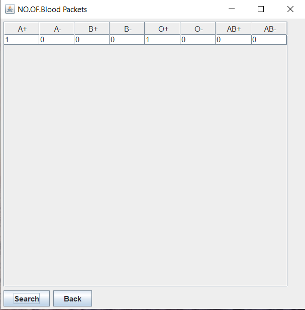

# bloodbank_management_system
Student Management System Dekstop application using java and swing Gui and mysql

# Project Title

Blood Bank Management is a Dekstop Application using Java Swings ,Mysql and JDBC connectivity gives number of blood packets in the system and information about donor and recipient.

# login page

# home

# New Donor

# Search new donor

# view new donor

# reciepent

#reciepent details

# No of blood of packets of various blood group in the bank

